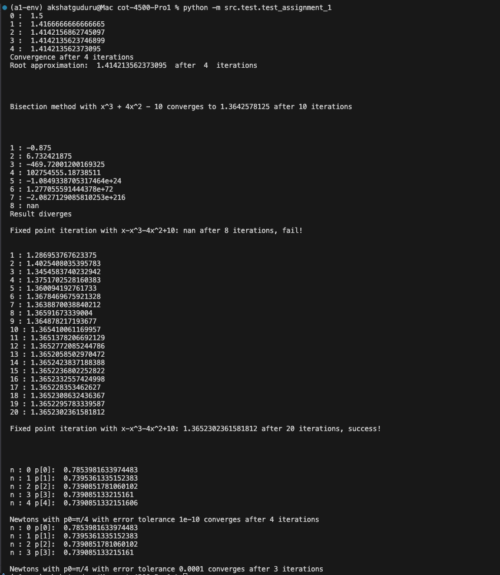

# cot-4500-Pro1

First clone the repo using

git clone https://github.com/akki-g/cot-4500-Pro1

To run the program, you need to have Python 3 installed. 

Create a virtual environment by running the following command in the terminal:
python3 -m venv a1-env

Activate the virtual environment by running the following command in the terminal:
source a1-env/bin/activate (if running on macOs)
a1-env\Scripts\activate  (if running on windows)

Then ensure you have the following packages installed:
numpy
install by running the following command in the terminal:
pip install -r requirements.txt

You can run the program by executing the following command in the terminal:

python -m src.test.test_assignment_1

The program will output the results of the test cases in the terminal.

Example output
